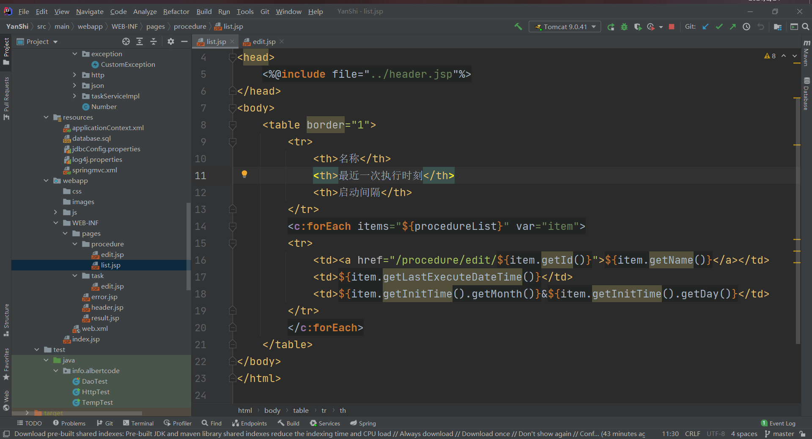

只需要设计前端的显示就行，无需关心其与后端的交互。例如在流程list页面中，虽然在项目中目前如下图所示，但这是添加了许多与后端相关的代码，只需要设计一个纯html（加上展示效果所需的js与css）的页面即可，换句话说，其实就是能直接在WebStorm里面打开并在浏览器显示的页面。

例如与上图对应，其所需的前端页面只是如下图所示

动态内容（即需要后端提供的数据）使用占位符标记一下就行，如果页面存在重复内容，例如上图中一个表格可能有多行，只需随意重复一下即可。

## 具体需求

### 流程（Procedure）相关

#### 流程列表页

主要作用是展示数据库中存在的流程，一页最多显示10个流程（随便想的，以后可能改，这个不关键），主要包括两个部分，分别为主题的表格部分，以及页号。

表格部分分为三列，标题分别为 “名称”，“最近一次执行时刻”，“启动间隔”

页号需要包括 “上一页”，“下一页” 按钮，普通页号按钮，当前页号需要与普通页号按钮不同（例如现在是第3页，可以将数字3所在的那个按钮放大，或者改变颜色，用以提示用户当前是第几页）

其他内容可随性发挥

#### 流程编辑页

主要作用是编辑或者新建一个流程，本质上就是让用户提供一些键值对，例如 名称：获取百度首页 等，键都是确定的，用户只需要根据提示输入值即可。

键包括“流程名”，“启动间隔”，除此之外还需要一个提交按钮，最好也设计一个新建任务按钮（用于直接在这个页面新建一个当前流程的任务）。启动间隔最好设计成单选下拉框，或者单选框，如上图所示。因为目前对外提供了两种设计流程间隔的方式，分别为在某个确定的时间点，如每天12点启动，或者每隔一段时间启动，如每隔30分钟启动一次。所以需要用户选择采用哪种方式。

当用户选择了在确定时间点启动时，需要用户输入 月，日，周几（WeekDay），时，分（稍微解释一下，以防你来杠我。这五项用户不需要全部填写，例如只填写时与分，代表在每天的x点x分执行，如果只填写周几、时、分，代表在每周x的x点x分执行），当用户选择了每隔一段时间执行，则需要提供 天间隔，时间隔，分间隔，分别代表每隔 x天x时x分执行一次，用户也是不用全部填写的，后端会自动进行分析。

需要在用户选择某种启动方式以后，才出现对应的填写内容，如果切换了启动方式，也需要相应的切换填写内容，所以这部分，必然会用到 javascript

#### 流程展示页

展示某个具体的流程，目前和流程编辑页用的同一个页面，不做这个也行，如果有空的话，也可以专门设计一下。

### 任务（Task）相关

#### 任务编辑页

和流程编辑页类似，主要作用是用来编辑或者新建一个任务。也是用户提供一些键值对就行，键已经确定好，用户只需要填写值即可。

键包括 任务名称，任务种类，请求总览（Overview），请求头部（Header），请求主体（Body），其中任务种类后端会提供几个选项，所以最好设计成下拉框，我用 select 做了个下拉框的设计（webapp/WEB-INF/pages/task/edit.jsp 里），你可以就采用这个，但需要稍微美化一丢丢。

此外，任务也有两种，一是整个流程的入口任务，二是其他普通任务，对于入口任务，需要填写流程名称，对于普通任务，需要填写前置任务的名称，这个怎么设计就看你了。这个用户是可以随时修改的，两种状态也可以切换（不要问为啥，他就是可以切换，比如你现在一时兴起，就是想在入口任务前面加一个新任务，那么之前的入口任务就应该要被切换成普通任务）。唯一的要求就像流程编辑页里面，启动间隔一样，两种方式所需的输入不能同时出现，要么填写所属流程，要么填写前置任务，可以像流程编辑页里的启动间隔一样用下拉框，或者单选框也行，看你怎么设计。

最后，还需要一个提交按钮。

#### 任务展示页

目前也是和任务编辑页一个页面，有时间的话可以单独设计。