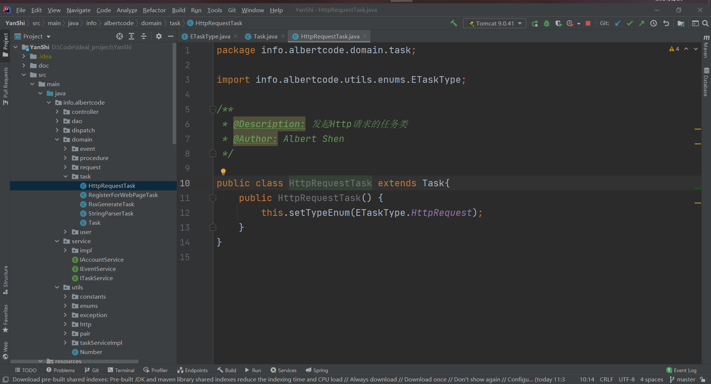
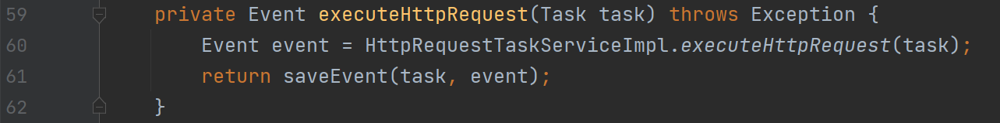

## 数据结构定义

主要数据结构分为四类，分别为 流程（Procedure），任务（Task），请求（Request），事件（Event）

主要数据结构的类图如上图所示。

对于开发者而言，开发的模块是以 Task 为基本单位，一个Task将会实现一个较为独立的功能，如发送 Http 请求并接受相应的 Http 响应，解析一个字符串等。Task 也是总体而言最为复杂的一个部分。对于一个 Task，其具有且只具有一个 Request，Task 中的属性主要分为两类，一是 YanShi 控制Task执行的相关属性，如 inputTask，nextTasks 等，二是用于向用户展示并标识某一 Task，如 name 等。这部分内容要么由 YanShi 进行维护，要么仅仅是作为展示，几乎不会影响到具体某个 Task 内部的执行逻辑。

Request，此类与 Task 一一对应，将会较大的影响到 Task 的内部执行逻辑，主要用途是作为 Task 的输入。主体包括 Overview，Header，Body 三部分，这三部分在功能上没有区别，仅仅为了方便开发者进行不同的语义标识。如对于 Http 请求任务，可以在 Overview 中存储请求的方法，请求的链接，请求的代理等，在 Header 中储存请求头信息，在 Body 中储存请求体信息，但这并非强制要求，开发者也可以将所需信息完全储存于一个字段中，但不推荐此方式。

Event，此类用于储存 Task 的执行结果，同时一个 Task 除了具有 Request 外，还包含一个前置任务（inputTask，这部分由 YanShi 负责维护，开发者可以通过相应 get 方法直接获取），而此前置任务的 Event 则会被视为当前 Task 的一个输入。例如对于字符串解析 Task，除了具有一个 Request 用于指定解析方法，解析语句等，其具体解析的字符串就是前置任务的 Event。每一个 Task 在执行完成后，需要开发者将结果封装为一个 Event。与 Request 类似，Event 也具有 Overview，Header，Body 三个部分，功能上没有区别，但仍建议开发者从语义上对其进行区分。

上述三个部分，是一个具体的 Task 执行时所需的全部内容了，Request 与 Task 是属于一种较强的绑定状态，且某一个 Task 的 Request 不会被其他 Task 所访问，但对于 Task 的输出 Event，由于可能会作为其他 Task 的输入，所以在语义上会采用更加通用的方式，例如 json。

Procedure，此类是对用户暴露的部分，虽然 Task 也需要用户进行编辑，但在执行时，总是以 Procedure 作为一个单位（虽然保留了执行具体某一个 Task 的功能，但此功能是作为开发者与用户测试自己编写的程序是否存在问题，测试使用的）。一个 Procedure 除了一些基本信息外，主要包含一个 Task，此 Task 是当前 Procedure 的入口任务，即当需要执行某一 Procedure 时，将会从此入口任务开始，逐个执行，直至没有后续任务。相对于 Task，Procedure 主要封装了定时执行的相关属性，对用户暴露一些接口，允许用户要求此 Procedure 定时执行，或立即执行。

对于执行一个 Procedure 与执行一个 Task，主要区别在于 Procedure 可以定时执行，以及将会执行所有后续任务，而如果只是执行一个 Task，在此 Task 执行完成后，其后续任务将不会被自动执行。

## 核心调度逻辑

此部分由 YanShi 负责维护。主体包括三个部分，控制器（Controller），定时器（Timer），执行器（Executor）。

Controller，是整个调度逻辑的核心。

Timer，负责对流程进行定时，并在合适的时间向 Controller 发送调度请求。

Executor，负责执行具体的 Task。

用户并不是一个类，指实际用户，用户可以通过向 Timer 发送 Procedure 的方式，在 Timer 中进行注册某个 Procedure，从而将此 Procedure 加入至整体的调度逻辑中。

整体调度逻辑采用多线程的方式，并利用了线程池技术。其中 Controller 与 Timer 由于功能较为重要，将会始终各保留一个线程用于执行 Controller 与 Timer，防止由于任务压力过大，导致 Controller 与 Timer 长期饥饿，对整体的调度造成影响。

用户与 Timer 之间的交互采用“生产者消费者”模式，其中用户为一个不定期生产产品的生产者，Timer 是会尽快消费产品的消费者。Timer 与 Controller 之间的交互也采用“生产者消费者”模式，其中 Timer 为一个不定期生产产品的生产者，Controller 是会尽快消费产品的消费者。Controller 与 Executor 之间的交互同样采用“生产者消费者”模式，其中 Controller 为一个不定期生产产品的生产者，Executor 是会尽快消费产品的消费者，与普通的“生产者消费者”模式不同，Executor 可能也会生产产品。

接下来以一个例子来说明主要的调度逻辑。

当用户编辑完成一个 Procedure 后，YanShi 将会自动调用相关方法，将此 Procedure 提交给 Timer，Timer 对 Procedure 进行分析，计算出此 Procedure 的预计执行时间，在计算完成后，Timer 将会获得当前所有已经注册的 Procedure 的执行时刻，然后进行休眠，其休眠时间为最近需要执行的 Procedure 的所需等待时间。Timer 有两种被唤醒的方式，一是用户提交了一个 Procedure，二是 Timer 自己设定的休眠时间到达。当 Timer 被唤醒后，将会判断当前是否有 Procedure 需要执行，如果需要执行，则会将 Procedure 提交至 Controller 并唤醒 Controller。

Controller 被唤醒后，将会查询是否存在 Procedure 与 Task 需要执行，若存在，则会对其进行解析，然后从线程池中申请一个线程用于执行 Executor，并将需要执行的 Task 提交给此 Executor。当不存在需要执行的 Procedure 与 Task 时，Controller 将会自动进入休眠，此休眠只能被其他线程唤醒，并不会像 Timer 那样进行定时。

Executor 被创建后，将会根据获得的 Task ，调用相关方法进行执行，并获得此 Task 的后续任务，并将后续任务提交给 Controller，唤醒 Controller，然后自身将会被线程池回收。

总而言之，Timer 与 Controller 是两个会休眠，不会被回收，生命周期等同于整个项目的执行周期的线程，而 Executor 是被 Controller 创建并从线程池中分配线程执行的一系列线程，其生命周期在执行完成给定 Task 后就会结束。

## 如何开发新功能

如果开发的新功能只是一种新任务，如发起 prc 调用等，则只需要关心 Task，Request，Event 的相关内容即可。

### 项目整体代码结构

如上图，整体代码逻辑的后端部分均在 src/main/java/info/albertcode 下。其中 controller 包是与前端进行交互的代码逻辑，如生成前端页面，解析前端发送的数据等；dao 包是与数据库进行交互的代码逻辑；dispatch 包是上文中所提到的核心调度逻辑相关的代码；domain 包中定义了主要的数据结构，如上文提到的 Task，Procedure 等；service 包是业务逻辑代码，通过结合 dao，并被 controller 包调用的方式，连接整个项目；utils 包，包括基础工具类（如键值对类）与较为复杂的任务执行逻辑（如发起 http 请求）。

若要开发一种新任务，则主要需要修改 domain，service，utils 中的相关代码。

### 开发新任务的流程

首先需要在 utils.enums.ETaskType 中定义当前任务的枚举类型，此枚举类型将会在后续代码中用于判断某个任务是什么类型，需要调用哪一个方法进行执行等。注意，为了保持新增任务类型后，无需修改数据库中原有数据，在定义任务类型的枚举变量时，其 value 不可与已有枚举重复，也不可修改已有类型的 value。

然后需要在 domain.task 中新建一个自定义 Task 类，此类需要继承 Task 父类，如下图所示。一般而言，自定义的 Task 类仅需添加一个构造方法，用于自动指定任务类型。（正如上文所说，Task 类中的大部分内容均由 YanShi 完成了维护，主要用户逻辑控制与展示）

然后在 domain.request 中新建一个自定义 Request 类，此类需要继承父类 Request，如下图所示。对于自定义 Request，往往需要重写 Overview，Header，Body 相关方法（也可以不重写，根据当前 Task 的实际情况进行分析），例如在 Http 任务中，采用 utils 包中的键值对类，来重新解释了 Overview，Header，Body。重新解释的目的是为了对其进行语义化，方便后续代码的调用。同时需要注意，数据库中只会存储 Overview，Header，Body 这三个字段，而不会存储其他自定义的字段，所以当使用其他方式重新解释了这三个字段以后，需要重写相关的 get 与 set 方法，保证能将数据存储于数据库中，并从数据库中重新获取。

【注意】对于任何一个自定义 Request，均需要实现一个构造方法，此构造方法用于从父类 Request 构造当前类，实现此构造方法的原因，是因为从数据库中获取的请求类均被封装为父类 Request，如果直接使用父类 Request，则无法调用自定义 Request 中的相关方法。此构造方法的主要目的，即为将父类 Request 转换为给定的自定义 Request。

然后新建一个自定义 Event 类，自定义 Event 类与自定义 Request 类类似，需要重新解释 Overview，Header，Body。

然后在 utils.taskServiceImpl 中添加一个自定义类，用于执行具体方法。若此类需要上一个 Task 的 Event 作为输入，则需要继承 TaskWithInputEvent 类，其中提供了获取输入 Event 的相关方法。

整个类的入口如下所示，即外部需要调用此方法，而其他方法仅仅是为了辅助此方法而编写的，除此方法外均可以被设置为 private。

注意事项：

- 此类中的所有方法均需要被 static 修饰（静态方法）
- 入口方法需要一个参数 Task
- 入口方法返回一个 Event

在完成了 Task 的执行逻辑后，需要在 service.impl.TaskServiceImpl 类中的此 switch 语句中，添加执行自定义 Task 的方法即可。

为了对执行 Task 的代码隐藏数据库的相关内容，故往往是在此类中添加一个方法，用于完成数据库的维护，此方法相较于直接调用，仅仅是在调用完成后调用了保存相应数据至数据库中的方法。

至此，一个新任务就开发完成，可以被 YanShi 进行管理。